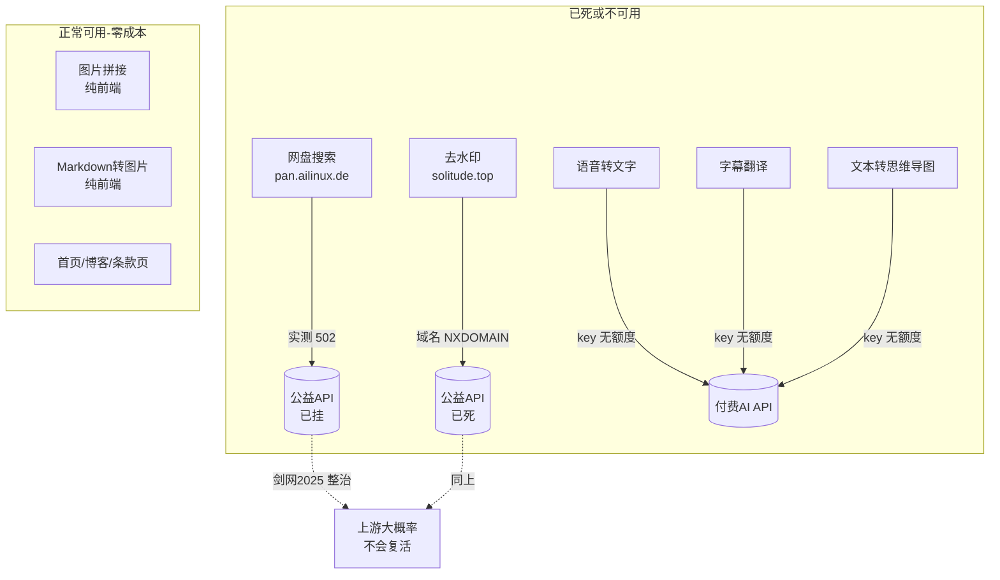
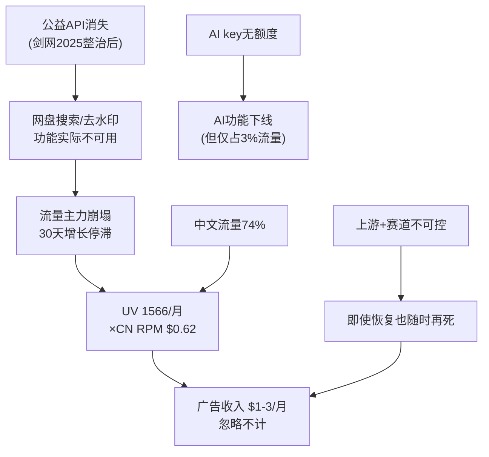
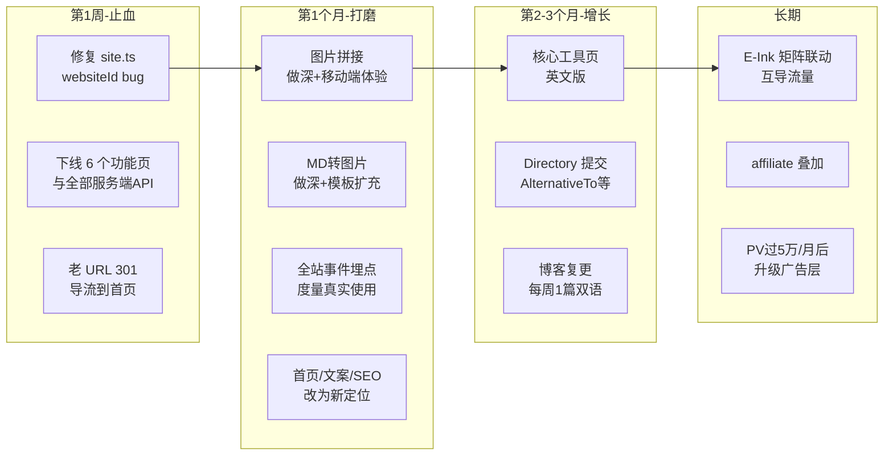

# mihoyonb.com（原牛）转型调研报告

> 调研日期：2026-10-09 ｜ 数据来源：Umami 真实数据（2026-06-06 起）、代码仓库（dev 分支）、上游 API 实测、公开网络调研
> 约束条件（站主设定）：**零成本运营**（不再购买 API 额度）、兼职维护、目标是**持续赚点小钱**

---

## 一、执行摘要

**核心结论：这不是"变现方式"的问题，而是"流量地基"的问题。建议放弃网盘搜索/去水印赛道（监管重压 + 上游已死），把站点收缩重定位为「零成本运行的自媒体创作工具箱」，并把矩阵精力向 E-Ink 站倾斜。**

三个关键事实：

1. **带来 ~77% 流量的两个功能已经死了**：网盘搜索上游 API（pan.ailinux.de）实测返回 502，去水印上游（www.solitude.top）域名已失效（NXDOMAIN）。当前访客打开这两个页面是拿不到结果的。
2. **收益数学不成立**：近 30 天 UV 仅 1,566，其中 74% 来自中国大陆（AdSense 中文流量 RPM ≈ $0.62，约为美区 $4.59 的 1/7）。当前量级下广告收入理论上限每月 $1–3，与"忽略不计"的体感完全吻合。
3. **花钱的功能没人用**：依赖付费 API 的语音转文字、字幕翻译、思维导图合计流量占比 < 3%（语音转文字 90 天仅 16 次访问）；带来流量的网盘搜索/去水印反而不花一分钱（蹭公益 API）。成本结构与流量结构完全倒挂。

---

## 二、现状盘点

### 2.1 功能全景与依赖关系

### 2.2 流量真相（Umami 实测）

**整体（近 90 天 / 近 30 天）：**

| 指标 | 90 天 | 30 天 | 30 天环比 |
|---|---|---|---|
| PV | 8,116 | 2,847 | +4.4% |
| UV | 4,550 | 1,566 | **+0.1%（停滞）** |
| 访问次数 | 6,476 | 2,245 | +3.4% |
| 跳出率 | 83.6% | 83.4% | — |
| 人均停留 | ≈59 秒 | ≈64 秒 | — |

> 90 天环比曾 +168%（7–8 月增长），但近 30 天已经完全停滞——推测与上游 API 逐步失效的时间点吻合（推断）。

**页面结构（90 天，Umami 页面指标）：**

| 页面 | 访问量 | 占比 | 现状 |
|---|---|---|---|
| /pan-search 网盘搜索 | 5,110 | ~63% | ❗上游 502 |
| / 首页 | 1,309 | ~16% | 正常 |
| /video-watermark 去水印 | 1,138 | ~14% | ❗上游域名失效 |
| /text-to-mindmap | 184 | ~2% | ❗无 key |
| /blog（4 篇，2025-08 停更） | 58+91 | ~2% | 正常 |
| /text-to-speech | 43 | <1% | ❗依赖不明 |
| /image-combine | 31 | <1% | 正常 |
| /voice-to-text | 16 | <1% | ❗无 key |

**渠道与人群：**

- 渠道：direct 56.6%、自然搜索 6.8%、社交 1%；referrer 主要是 google（215）、yandex（96）、bing（74）、v2ex（55）、linux.do（28）
- 国家：CN 74%、US 7%、SG 6%、HK 4%、JP 3%（中文用户为主的海外站）
- 设备：移动 54%、桌面 41%
- 事件埋点：**0**（无任何转化/使用行为的追踪，无法评估功能真实使用率）

### 2.3 矩阵视角（同一 Umami 实例，近 30 天）

| 站点 | PV | UV | 相对量级 |
|---|---|---|---|
| **E-Ink (e-ink.me)** | **132,065** | **50,703** | **mihoyonb 的 32 倍** |
| ChatTempMail | 11,345 | 3,928 | 2.5× |
| Flowable | 8,230 | 3,319 | 2.1× |
| FWFW | 3,398 | 1,593 | ~1× |
| iloveepub | 3,144 | 1,109 | 0.7× |
| **mihoyonb** | 2,847 | 1,566 | 1× |

> mihoyonb 是矩阵里流量最小的站之一，而 E-Ink 一个站的 UV 等于其余所有站之和的数倍。资源分配值得重估。

### 2.4 代码层发现

- **埋码 bug**：`src/config/site.ts` 中 `analytics.umami.websiteId` 为 `650f7dc5-...`，该 ID 在 Umami 中**不存在**（真实 ID 是 `27bf8427-...`，线上旧版本仍在用正确 ID 上报）。**一旦以当前代码重新部署，统计立即中断**，先改回再部署。
- AdSense 仅在 `layout.tsx` 挂了全局自动广告，无手动广告位、无搜索广告。
- 博客最后更新 2025-08-23，停更 13 个月。

---

## 三、核心诊断

1. **收益数学不成立**：UV × RPM 决定了小流量中文站挂广告没有出路。要让 AdSense 月入 $100，按 CN RPM 需要约 16 万 PV/月（当前是 2,847）；按 US RPM 也需要 2.2 万 PV/月。
2. **流量地基是借来的**：两个主力功能依赖第三方公益 API，没有任何可控性。实测均已死亡。这类聚合 API 在「剑网2025」整治网盘传播链后大面积消失（详见 4.1），**复活概率低，即使复活也会再死**。
3. **监管风险实质化**：2025 年 5 月国家版权局等四部门启动[「剑网2025」专项行动](http://www.xinhuanet.com/legal/20250516/b1fbc5be424c4df29dc0ef873e160fc7/c.html)，重点整治**「网络存储+传播领域**、打击"帮助侵权"——网盘搜索站正是典型形态；网盘平台已清理盗版分享链接约 15 万条、夸克封禁历史公开分享。百度/阿里/夸克官方也在清退第三方检索。此赛道处于结构性收缩，不是周期波动。
4. **AdSense 政策风险**：为盗版资源提供检索/下载入口的内容违反 AdSense 政策，被举报后可能整站封号——**连带矩阵里其他站的 AdSense 收益**。
5. **成本与流量倒挂**：付费的 AI 功能无人使用（语音转文字 90 天 16 次访问），免费蹭来的功能带来全部流量。好消息是：砍掉付费 API 后几乎没有沉没损失。

---

## 四、市场调研关键结论

### 4.1 赛道（网盘搜索/去水印）：衰退期，不建议恋战

- 「剑网2025」四部门专项行动（2025-05~11）重点打击"网络存储+传播"帮助侵权（来源：[新华网](http://www.xinhuanet.com/legal/20250516/b1fbc5be424c4df29dc0ef873e160fc7/c.html)）
- 各网盘清查违规分享：[中公网校转载报道](https://www.eoffcn.com/wiki/support/fgfadtom/index.htm)提及约 15 万条盗版链接被清理
- 剩余竞品的变现（夸克拉新返利等灰产）依赖国内主体与合规化运营，与"海外站+零成本+兼职"约束不匹配

### 4.2 零成本 AI 方案：成熟可用（这是本次调研最大的好消息）

| 功能 | 首选方案（免费） | 关键数据 |
|---|---|---|
| 语音转文字 | **Groq whisper-large-v3-turbo** | 免费 20 RPM / 每天 28,800 音频秒（≈8 小时音频/天），OpenAI 兼容接口，现有代码几乎只改 baseURL（[Groq Rate Limits](https://console.groq.com/docs/rate-limits)） |
| 语音转文字（备选） | SiliconFlow `SenseVoiceSmall` | 免费、中文识别效果好、国内直连（[SiliconFlow 文档](https://docs.siliconflow.cn/cn/faqs/misc_rate)） |
| 字幕翻译 / 思维导图 | SiliconFlow 免费 Qwen 或 Gemini 2.5 Flash 免费层 | 纯文本任务额度消耗低；注意 Gemini 免费层输入会被用于训练，需隐私政策披露（[Gemini Terms](https://ai.google.dev/gemini-api/terms)） |
| 文字转语音 | 浏览器 `speechSynthesis` | 完全免费零后端；中文音色偏机械，可作免费档 |
| 兜底方案 | transformers.js 浏览器端 whisper | 78–86MB 模型、Apache 2.0 可商用，中文偏弱；WebGPU 下可快于实时（[transformers.js](https://github.com/huggingface/transformers.js)、[官方实时转写 demo](https://huggingface.co/spaces/Xenova/realtime-whisper-webgpu)） |
| 字幕翻译（纯浏览器） | **Chrome/Edge 内置 Translator API** | Chrome 138+ / Edge 148 桌面版已稳定提供，本地设备模型、免费、离线；**移动端不支持**，需能力检测降级（[Locize](https://www.locize.com/blog/browser-translates)、[MDN](https://developer.mozilla.org/en-US/docs/Web/API/Translator_and_Language_Detector_APIs)） |

### 4.3 变现杠杆（按确定性排序）

1. **英文化 = 最大的单一杠杆**：美区 RPM $4.59 vs 中国 RPM $0.62，约 **7 倍差距**（[Easton Dev 实测](https://eastondev.com/blog/en/posts/media/20260108-adsense-high-cpc-niches)、[各国 CPM 表](https://bridgingpointsmedia.com/google-adsense-cpm-rates-by-countries)）。纯前端工具站做双语成本极低。
2. **Directory 提交（免费外链+流量）**：AlternativeTo（DR 79）、There's An AI For That、Toolify、SaaSHub 等均免费（[2026 目录榜单](https://smollaunch.com/best-of/best-directories-to-submit-ai-tool-2026)）。
3. **广告层升级**：PV 上量后 AdSense → Ezoic/Media.net（案例：ascii-code.com 换 header bidding 后 +309%，[Setupad 案例](https://setupad.com/blog/ad-revenue-increase-case-study)）。
4. **卖站退出**：工具站典型成交价 **25–40× 月净利润**（[Flippa 估值指南](https://flippa.com/blog/how-much-is-my-website-worth)）。月入 $200 的站 ≈ $5,600–8,000 退出价值。
5. 参考案例：Photopea 单人免费工具站 $3M/年（90% 广告收入，前 5 年零收入）（[Indie Hackers](https://www.indiehackers.com/post/tech/making-3m-per-year-with-a-free-product-axW4u1vB6C8f91Z3Lxu5)）——工具站模式本身成立，前提是量级和人群购买力。

---

## 五、转型建议

### 三条可选路线

| 路线 | 内容 | 预期 | 适合 |
|---|---|---|---|
| **A. 极简收缩：只保留纯前端工具（最终决策，2026-10-09 站主确认）** | **只保留现在已是纯浏览器实现的 2 个功能**：图片拼接、Markdown 转图片；**下线其余全部 6 个**（网盘搜索、去水印、语音转文字、文字转语音、字幕翻译、思维导图——纯浏览器化效果差或依赖已死，直接不要）；定位保持自媒体创作工具；后续再按需新增纯浏览器功能；逐步英文化 | 维护面 9→2，全部零依赖零成本零密钥；可纯静态部署（托管费归零）；预期 UV 先跌后升（失去灰色流量，换取可累积的合规资产）；后续新功能按 SEO 需求验证后再加 | 愿意每周投入几小时 |
| B. 免费 API 复活（已放弃） | Groq/SiliconFlow 等免费层复活服务端 AI | 质量上限更高（尤其中文 ASR），但仍依赖外部、需管理 key 与限流，与零维护诉求冲突 | — |
| **C. 止血保号** | 只下线灰色功能、修复 bug、挂捐赠+directory 提交，不再开发 | 维持 $5–10/月，几乎零维护 | 不想再花精力 |
| **D. 卖站退出** | 恢复可用性→养 3 个月数据→Flippa/私下出售 | 按 25–40× 月利润，当前量级估值很低（几百美元级），**不划算，建议至少先做 A** | 彻底放手 |

### 推荐组合路线图

### 关键决策说明

1. **为什么要下线而不是修复网盘搜索/去水印**：① 上游已死且无替代（公益聚合 API 被「剑网2025」生态性清除）；② 自建网盘索引 = 高成本 + 高法律风险 + AdSense 封号风险；③ 该流量即使恢复也不产生有意义收入（中文 RPM）。
2. **为什么保留页面做 301 而不是删除**：pan-search 页面可能有搜索排名（google/bing referrer），301 到首页或「资源无法提供」的说明页可保留域名的 SEO 价值。
3. **最终功能取舍**（2026-10-09 站主确认：只保留现在已是纯浏览器实现的功能，其余不要；纯浏览器化效果差的功能（语音转文字/字幕翻译）不再投入）：

   | 功能 | 去留 | 依据（90 天访问量为 Umami 实测） |
   |---|---|---|
   | 图片拼接 | ✅ 保留 | 已是纯前端；移动端可用（54% 移动流量）；自媒体排版刚需；竞品多收费/限次，可打「免费+无限制」 |
   | Markdown 转图片 | ✅ 保留 | 已是纯前端；知识卡片/分享图是稳定长尾需求；Carbon 等已验证垂直小工具的全球市场 |
   | 网盘搜索（5,110） | ❌ 下线 | 上游 502 已死 + 剑网2025 监管 + AdSense 封号风险；301 保留 SEO 价值 |
   | 去水印（1,138） | ❌ 下线 | 上游域名失效，同上 |
   | 语音转文字（16） | ❌ 下线 | 历史 demand 极弱；浏览器端中文质量无优势（whisper-base 中文弱、移动端慢），不值得投入 |
   | 文字转语音（43） | ❌ 下线 | 历史 demand 极弱；speechSynthesis 音色机械，无竞争力 |
   | 字幕翻译 | ❌ 下线 | 纯浏览器方案仅桌面 Chrome/Edge 可用（内置 Translator API），覆盖面不足 |
   | 思维导图（184） | ❌ 下线 | 依赖 AI key；需求弱；markmap 依赖随之移除 |

   **工程要点**：① 删除 6 个功能的页面、组件与全部服务端 API 路由（voice-to-text / subtitle-translate / text-to-mindmap / text-to-speech / search / video-analyze / video-download / video-proxy），依赖清理（markmap-lib、markmap-view、axios 等可一并移除，减小包体）；② 老页面 301 到首页或对应博客文章，保住域名 SEO 权重；③ `site.ts` 的 title/description/keywords 同步改写（当前还写着网盘搜索、语音转文字等已下线功能）；④ `.env` 中 `AI_API_URL`/`AI_API_KEY`/`PAN_API_BASE_URL`/`VIDEO_API_BASE_URL`/`VOICE_API_*` 全部清除；⑤ 全站纯静态化后可托管在 Vercel/Cloudflare Pages 免费层，服务器成本归零；⑥ 卖点：中文「免费在线、无需注册、不限次数」，英文 "free, unlimited, no upload, privacy-first"。

   **后续新功能候选池**（站主：后续再看做什么纯浏览器自媒体功能——建议按 SEO 需求验证后再动手，每个都能纯 canvas/html2canvas 实现）：
   - 长图切割（切九宫格/三连图，发小红书/微博刚需）
   - 图片批量加水印（自媒体防盗刚需）
   - 封面文字图/标题卡片生成（小红书封面风格模板）
   - 图片压缩/格式转换（与矩阵 LLMOCR 能力协同）
   - 视频封面帧截取（本地文件抽帧）
   验证方法：目标关键词搜索量 + 竞品是否收费限次（有收费竞品 = 有差异化空间），先发 MVP 页面看自然点击再决定做深。
4. **矩阵资源再分配（推断）**：E-Ink 5 万 UV/月是矩阵真正的资产。mihoyonb 转型后适合作为"工具箱子站"与 E-Ink 互导（墨水屏用户 → 排版/图片工具）。若时间有限，优先优化 E-Ink 的变现（英文化/affiliate/广告层）比救 mihoyonb 的 ROI 更高。

---

## 六、风险与合规

| 风险 | 等级 | 缓解 |
|---|---|---|
| AdSense 因历史内容（网盘搜索）被追责封号 | 中 | 尽快下线相关页面；检查是否已有 policy warning |
| 大规模下线页面的 SEO 波动（短期内 UV 显著下跌） | 中 | 预期内：失去的 77% 流量本就建立在已死功能上；301 到首页/博客，Search Console 提交更新，观察 4–6 周 |
| 仅剩 2 个工具导致站点"单薄" | 低-中 | 首页改为工作流叙事 + 博客复更；按候选池逐步加纯浏览器功能 |
| 中文站内容合规 | 低 | 转型后内容全部为原创工具/教程，无版权敏感 |

---

## 七、立即行动清单（本周）

- [ ] `src/config/site.ts:37` 将 `websiteId` 改回 `27bf8427-c410-46a2-ad3f-404560e9ce6a`（否则下次部署统计中断）
- [ ] 下线 6 个功能页（pan-search / video-watermark / voice-to-text / text-to-speech / subtitle-translate / text-to-mindmap），老 URL 301 到 `/`
- [ ] 删除全部服务端 API 路由（voice-to-text / text-to-speech / subtitle-translate / text-to-mindmap / search / video-analyze / video-download / video-proxy）及无用依赖（markmap-*、axios 等）
- [ ] 同步改写 `site.ts` 的 title/description/keywords、首页导航与文案（去掉已下线功能的描述）
- [ ] 清理 `.env`：`AI_API_URL`/`AI_API_KEY`/`PAN_API_BASE_URL`/`VIDEO_API_BASE_URL`/`VOICE_API_*` 全部移除
- [ ] 给图片拼接与 MD 转图的核心按钮加 Umami 事件埋点（现在事件数是 0，无法度量任何改动的效果）
- [ ] AdSense 后台检查政策警告
- [ ] 视情况：纯静态化后迁移到 Vercel/Cloudflare Pages 免费层，服务器成本归零

---

## 附：数据口径说明

- 流量数据全部来自 Umami API 实测（skill: umami-analytics），非估算
- 页面占比使用 Umami metrics 返回值（口径为页面访问指标，与 UV 不可直接相加）
- 收入估算为推断（RPM 引用第三方公开数据），已在文中标注
- 上游 API 状态为 2026-10-09 实测：pan.ailinux.de → HTTP 502；www.solitude.top → NXDOMAIN
